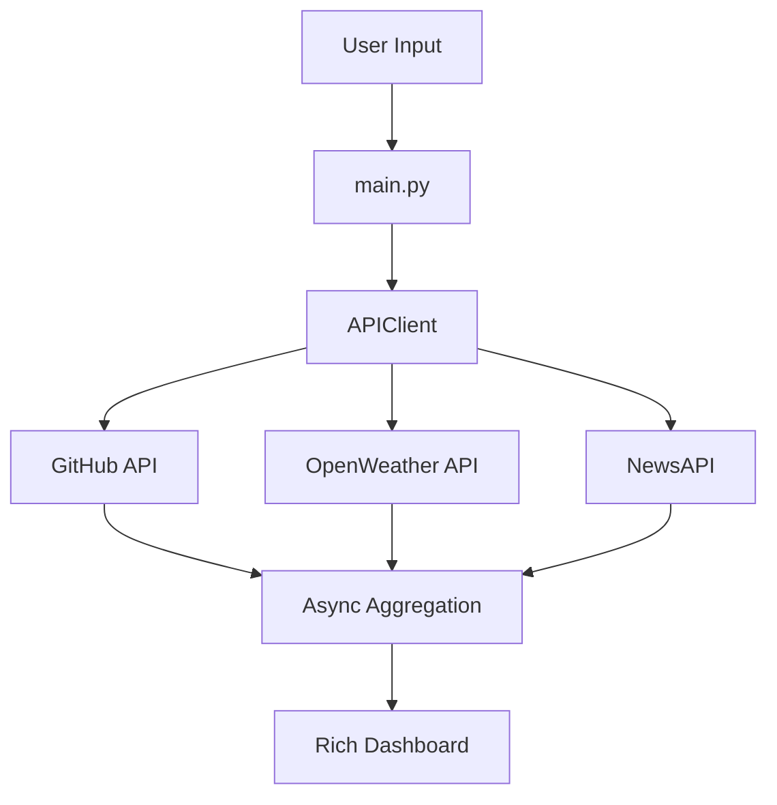

# 🚀 Async Multi-API Dashboard


An advanced asynchronous REST API client built with **aiohttp** and **asyncio** that fetches data concurrently from multiple public APIs and displays aggregated results inside a modern terminal dashboard powered by **Rich**.

---

## ⚡ Key Features

* 🔄 Fully asynchronous architecture
* 🌍 Parallel API calls using `asyncio.gather`
* 🔁 Automatic retry with exponential backoff
* 🚦 Built-in rate limiting
* 🎨 Interactive terminal dashboard
* 🔐 Secure API key input
* 🧠 Input validation & error handling
* 📊 Aggregated multi-source results

---

# 🏗 Architecture Overview



---

## 🧠 Architecture Explanation

### 1️⃣ Entry Layer (`main.py`)

* Collects user inputs (API keys, username, city, etc.)
* Validates inputs
* Runs concurrent API calls with `asyncio.gather`

### 2️⃣ Service Layer (`client.py`)

* Manages `aiohttp.ClientSession`
* Handles API requests
* Applies retry & rate limiting

### 3️⃣ Utility Layer (`utils.py`)

* Retry logic (Tenacity)
* Rate limiter using asyncio `Semaphore`

### 4️⃣ Presentation Layer

* Rich tables
* Spinner animation
* Clean formatted output

---

## 📂 Project Structure

```text
async-api-client/
│
├── main.py
├── client.py
├── utils.py
├── docs/
│   └── api_keys_setup.md
├── requirements.txt
└── README.md
```

---

## 🔧 Installation

### Clone repository

```bash
git clone https://github.com/YOUR_USERNAME/async-api-client.git
cd async-api-client
```

### Install dependencies

```bash
pip install -r requirements.txt
```

---

## 🔐 Required API Keys

* 🌦 OpenWeatherMap
* 📰 NewsAPI
* 🐙 (Optional) GitHub token

See:

```
docs/api_keys_setup.md
```

for step-by-step instructions.

⚠ API keys are requested securely at runtime and never stored in the code.

---

## ▶️ Usage

```bash
python main.py
```

The program will prompt you for:

* OpenWeather API key
* NewsAPI key
* GitHub username
* City
* Country code (us, fr, cm…)
* News category (technology, business…)

---

## 📊 Example Output

```
GitHub   → 8 repos | ⭐ 24 stars
Weather  → 26°C | 💧 78% | broken clouds
Top News → AI breakthrough changes industry (TechCrunch)
```

---

# 🧪 Technical Highlights

### 🔄 Asynchronous Execution

Uses:

```python
asyncio.gather()
```

to execute multiple API calls concurrently.

---

### 🔁 Retry Strategy

Implements exponential backoff with:

```python
tenacity.retry
```

---

### 🚦 Rate Limiting

Custom async rate limiter using:

```python
asyncio.Semaphore
```

---

### 🎨 Terminal UI

Built with:

* `rich.Table`
* `rich.Progress`
* Spinner animations

Provides a modern CLI dashboard experience.

---

# 📈 Skills Demonstrated

* Advanced async programming
* REST API consumption
* Concurrency handling
* Error management
* Terminal UI design
* Clean architecture structuring

---

# 🚀 Future Improvements

* CLI support with argparse
* Unit tests with pytest-asyncio
* Logging system
* Docker containerization
* Live auto-refresh mode
* Caching layer

---

# 🛡 Security Best Practices

* API keys are never hardcoded
* Sensitive data is hidden via `getpass`
* Clean separation of concerns

---

# 👨‍💻 Author

**Samuel (PHENO47)**
Future Full-Stack Developer | Cybersecurity Enthusiast | AI Learner

---

# 🏆 Project Level

Backend Async Project – Intermediate to Advanced
Portfolio-ready.

---
